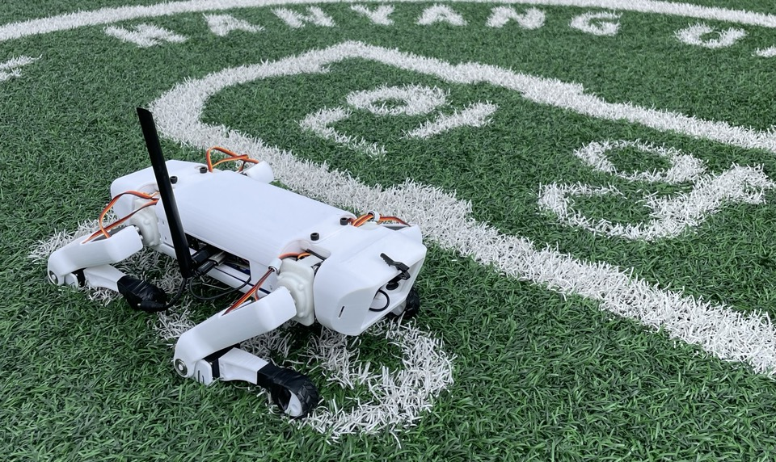

# SpotMicro_STT_2022
SpotMicro with Google Cloud Speech-to-Text

    

## News

- There's Full video instruction about this project [youtube link](https://www.youtube.com/watch?v=RocfxXIWZd4&list=PLK2UKp8KOXe1ZRbSmcO3VvE_TNs66K6lA)
- And also there's Notion Note for whole project process [Notion Link](https://www.notion.so/SpotMicro-for-G-Camp-c541934a4bad4ad48d1e37ab94c10de8) 
- Those Contents above are written in Korean

## Hardware:

The vast majority of the hardware by volume is designed to be 3D printed. So far complete prints have been successful in PLA, though no technical barriers should exist to printing the robot in other material such as PETG, nylon, ABS, etc. The majority of parts require significant supports to print.
For the most up-to-date version of the hardware please visit: [https://www.thingiverse.com/thing:3761340](https://www.thingiverse.com/thing:3761340). Please see documentation for details as to which files correspond to which servo. (I use `MG996R`)

## Electronics:

The `Jetson Nano` operates at 5.6v, and the `PCA9658` for driving the servomotor operates at 6v. In this project, the electronic department was constructed using 11.1v LiPo batteries and `XL4015` DC Converter.

## Results:

Test go & stop by speech recognition

    

**Contributors: Yongjun You, Kim Inwoo, Baek Sunghyun, Lee Byungyu**

**Thanks to Advice: Ji Minwoo, Choi Seunghwan, Jang Junhee**
